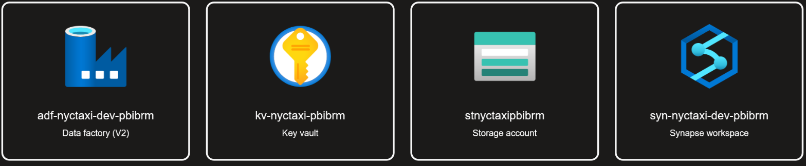
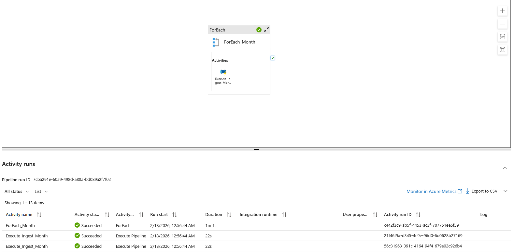
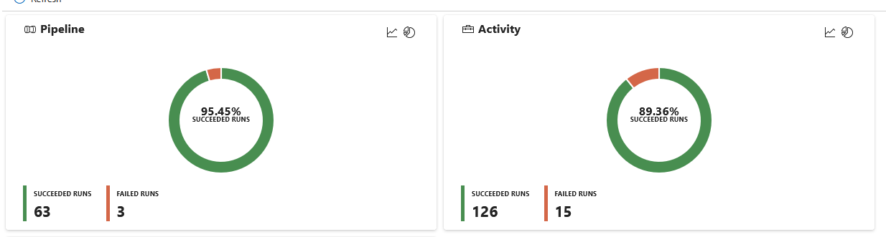
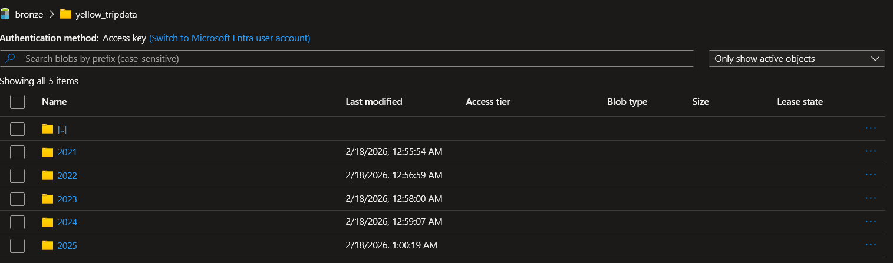
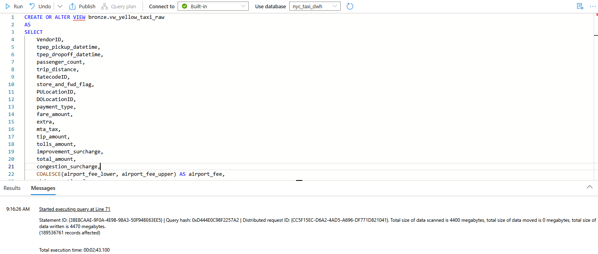
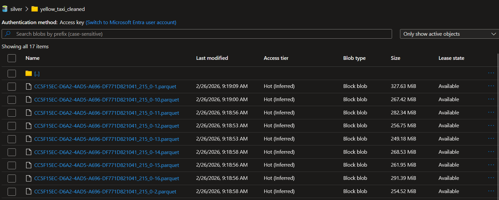

# Azure NYC Taxi — Data Lakehause

Hurtownia danych dla NYC Yellow Taxi zbudowana na platformie Azure w architekturze Medallion (Bronze → Silver → Gold).

> **Źródło danych:** [NYC TLC Trip Record Data](https://www.nyc.gov/site/tlc/about/tlc-trip-record-data.page)
> **Zakres:** Yellow Taxi, styczeń 2021 – listopad 2025 (~200M rekordów)

---

## Spis treści

1. [Architektura](#architektura)
2. [Infrastruktura (Terraform)](#infrastruktura-terraform)
3. [Ingestion — Bronze Layer](#ingestion--bronze-layer)
4. [Transformacja — Bronze → Silver](#transformacja--bronze--silver)
5. [Transformacja — Silver → Gold](#transformacja--silver--gold)
6. [Testy jakości danych](#testy-jakości-danych)
7. [Uruchomienie projektu](#uruchomienie-projektu)
8. [Dashboardy Power BI](#dashboardy-power-bi)


---

## Architektura


> **Storage:** Wszystkie warstwy (Bronze/Silver/Gold) → Azure Data Lake Storage Gen2

| Warstwa | Opis | Format | Lokalizacja |
|---------|------|--------|-------------|
| **Bronze** | Surowe dane bez zmian | Parquet (Snappy) | `bronze/yellow_tripdata/` |
| **Silver** | Wyczyszczone, ustandaryzowane | Parquet (Snappy) | `silver/yellow_taxi_cleaned/` |
| **Gold** | Zagregowane KPI i metryki | Parquet + Views | `gold/*/` |

### Użyte technologie

| Komponent | Technologia |
|-----------|-------------|
| IaC | Terraform |
| Ingestion | Azure Data Factory |
| Storage | Azure Data Lake Storage Gen2 |
| Processing | Azure Synapse Analytics |
| Wizualizacja | Power BI (DirectQuery) |
| Autoryzacja | Managed Identity|



---

## Infrastruktura (Terraform)

Cała infrastruktura zdefiniowana jako kod (IaC) w plikach `.tf`:

| Plik | Opis |
|------|------|
| `main.tf` | Provider, Resource Group |
| `storage.tf` | Storage Account, ADLS Gen2 filesystems (bronze, silver, gold) |
| `data_factory.tf` | Azure Data Factory |
| `pipeline.tf` | ADF Linked Services, Datasets, Pipelines (ingestion) |
| `synapse.tf` | Synapse Workspace (Serverless SQL Pool) |
| `security.tf` | Role assignments, Managed Identity |
| `variables.tf` | Zmienne|
| `outputs.tf` | Outputy (nazwy zasobów, URLs) |

---

## Ingestion — Bronze Layer

Azure Data Factory pobiera pliki Parquet z NYC TLC API i zapisuje je w ADLS Gen2 (Bronze).

### Pipeline

```
pl_ingest_year (ForEach month 01-12)
  └── pl_ingest_single_month (Copy Activity)
        Source: https://d37ci6vzurychx.cloudfront.net/trip-data/yellow_tripdata_{year}-{month}.parquet
        Sink:   bronze/yellow_tripdata/{year}/yellow_tripdata_{year}-{month}.parquet
```

| Parametr | Wartość |
|----------|---------|
| Równoległość | 4 miesiące jednocześnie |
| Retry | 2 próby, 30s przerwa |
| Timeout | 1h na plik |
| Kompresja | Snappy |

> ** Błedy w pipline wynikaja z tego ze za grudzien 2026 nie ma jszcze dostepnych plików a pipline próbował je pobrać** 






## Transformacja — Bronze → Silver

**Skrypt:** `sql/01_bronze_to_silver.sql`

Silver to wyczyszczona wersja danych Bronze. Strategia: **napraw co się da, usuń tylko błedne rekordy.**

### Krok 1: Widok Bronze (OPENROWSET)

Widok `bronze.vw_yellow_taxi_raw` czyta surowe pliki Parquet bezpośrednio z Data Lake.

> **Uwaga:** Kolumna `airport_fee` ma różną wielkość liter między latami (`airport_fee` w 2021, `Airport_fee` w 2025). Rozwiązanie: czytamy obie wersje i łączymy `COALESCE`.

### Krok 2: Naprawianie NULLi (COALESCE)

Zamiast usuwać wiersze z NULLami (~24% danych!), naprawiamy je sensownymi wartościami domyślnymi:

| Kolumna | Problem | Rozwiązanie |
|---------|---------|-------------|
| `passenger_count` | 24% NULL | → `1` (domyślnie 1 pasażer) |
| `RatecodeID` | 24% NULL | → `1` (taryfa standardowa) |
| `store_and_fwd_flag` | 24% NULL | → `'N'` (nie przechowywano) |
| `congestion_surcharge` | 24% NULL | → `0.00` |
| `airport_fee` | 24-91% NULL | → `0.00` |
| `cbd_congestion_fee` | nie istnieje do 2024 | → `0.00` |

### Krok 3: Filtrowanie (WHERE)

Usuwamy **tylko fizycznie niemożliwe rekordy** (~4.5% danych):

| Filtr | Usunięte | Dlaczego |
|-------|----------|----------|
| `VendorID IN (1,2)` | 1.54% | Vendor 7 ma 100% zepsutych dat, Vendor 6 nieoficjalny |
| `trip_distance > 0 AND < 500` | 2.62% | Zerowy dystans = anulacja/błąd GPS |
| `pickup < dropoff` | 1.49% | 97% to Vendor 7 (odwrócone daty) |
| `duration 1-1440 min` | 2.56% | < 1 min = test taksometru, > 24h = zapomniany |
| `LocationID 1-265` | 0.00% | Lokalizacje poza NYC |
| `Date 2021-2025` | 0.00% | Dane spoza zakresu ingestion |

> **Łącznie usunięto: ~4.5% | Zachowano: ~95.5%**

### Krok 4: Flaga `trip_status`

Ujemne kwoty (zwroty, reklamacje, spory) **nie są usuwane** — są oznaczone flagą:

| `trip_status` | Opis | Udział |
|---------------|------|--------|
| `valid` | Normalny kurs | ~87% |
| `correction` | Zwrot/reklamacja (ujemny fare lub total) | ~8.5% |

Dzięki temu Gold Layer może filtrować po `trip_status = 'valid'` dla czystych KPI, a korekty są dalej dostępne do osobnej analizy.

### Krok 5: Standaryzacja kolumn

- Nazwy → `snake_case` (np. `VendorID` → `vendor_id`)
- Typy → `DECIMAL(10,2)` dla kwot, `INT` dla identyfikatorów
- Kolumny pochodne: `trip_duration_minutes`, `trip_year`, `trip_month`, `trip_day`, `trip_weekday`, `pickup_hour`





