[](README.md)
[](README_PL.md)

# Azure NYC Taxi — Data Lakehouse

A data warehouse for NYC Yellow Taxi built on Azure using the Medallion architecture (Bronze → Silver → Gold).

> **Data Source:** [NYC TLC Trip Record Data](https://www.nyc.gov/site/tlc/about/tlc-trip-record-data.page)
> **Configured ingestion range:** Yellow Taxi, January 2021 – December 2025 (~200M records for the full 2021-2025 range)

---

## Table of Contents

1. [Architecture](#architecture)
2. [Infrastructure (Terraform)](#infrastructure-terraform)
3. [Ingestion — Bronze Layer](#ingestion--bronze-layer)
4. [Data Profiling — Bronze Layer](#data-profiling--bronze-layer)
5. [Transformation — Bronze → Silver](#transformation--bronze--silver)
6. [Transformation — Silver → Gold](#transformation--silver--gold)
7. [Data Quality Tests](#data-quality-tests)
8. [Getting Started](#getting-started)
9. [Power BI Dashboards](#power-bi-dashboards)


---

## Architecture


> **Storage:** All layers (Bronze/Silver/Gold) → Azure Data Lake Storage Gen2

| Layer | Description | Format | Location |
|-------|-------------|--------|----------|
| **Bronze** | Raw data, no modifications | Parquet (Snappy) | `bronze/yellow_tripdata/` |
| **Silver** | Cleaned & standardized | Parquet (Snappy) | `silver/yellow_taxi_cleaned/` |
| **Gold** | Star Schema (KPIs) | Parquet | `gold/*/` |

### Tech Stack

| Component | Technology |
|-----------|------------|
| IaC | Terraform |
| Ingestion | Azure Data Factory |
| Storage | Azure Data Lake Storage Gen2 |
| Processing | Azure Synapse Analytics |
| Visualization | Power BI (DirectQuery) |
| Authorization | Managed Identity |

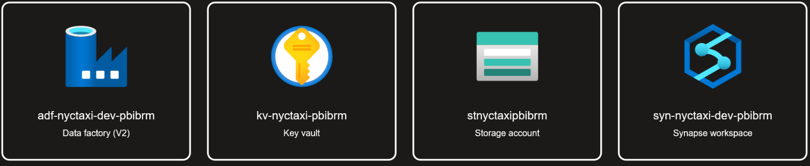

---

## Infrastructure (Terraform)

All infrastructure is defined as code (IaC) in `.tf` files:

| File | Description |
|------|-------------|
| `main.tf` | Provider, Resource Group |
| `storage.tf` | Storage Account, ADLS Gen2 filesystems (bronze, silver, gold) |
| `data_factory.tf` | Azure Data Factory |
| `pipeline.tf` | ADF Linked Services, Datasets, Pipelines (ingestion) |
| `synapse.tf` | Synapse Workspace (Serverless SQL Pool) |
| `security.tf` | Role assignments, Managed Identity |
| `variables.tf` | Variables |
| `outputs.tf` | Outputs (resource names, URLs) |

---

## Ingestion — Bronze Layer

Azure Data Factory downloads Parquet files from the NYC TLC API and stores them in ADLS Gen2 (Bronze).

> **Current repo state:** Terraform defines ADF pipelines for Bronze ingestion and metadata copy. Silver/Gold SQL transformations are executed manually in Synapse Studio in the current version of the project.

### Pipeline

```
pl_ingest_all_data (ForEach year 2021-2025)
  └── pl_ingest_year (ForEach month 01-12)
        └── pl_ingest_single_month (Copy Activity)
              Source: https://d37ci6vzurychx.cloudfront.net/trip-data/yellow_tripdata_{year}-{month}.parquet
              Sink:   bronze/yellow_tripdata/{year}/yellow_tripdata_{year}-{month}.parquet

pl_ingest_metadata
  └── Copy taxi_zone_lookup.csv to bronze/metadata/
```

| Parameter | Value |
|-----------|-------|
| Parallelism | 4 months concurrently |
| Retry | 2 attempts, 30s interval |
| Timeout | 1h per file |
| Compression | Snappy |

> **Note:** The top-level ingestion pipeline iterates through all months in 2025. If a late-period source file is not yet available from NYC TLC at runtime, that month may fail and can be retried later.

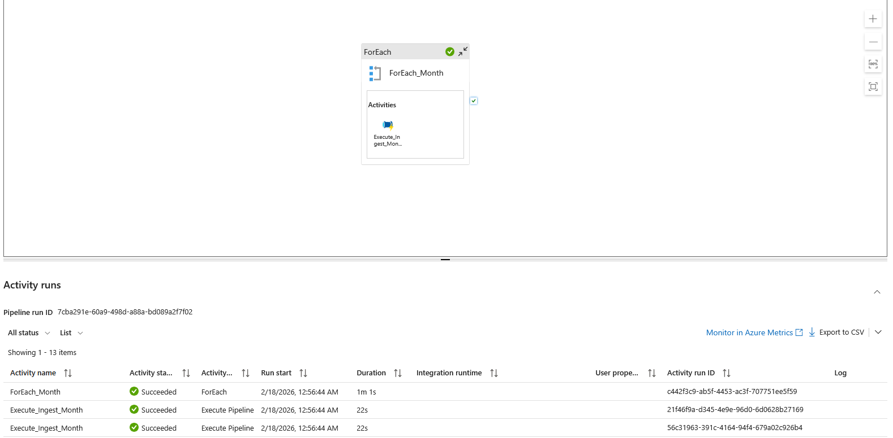
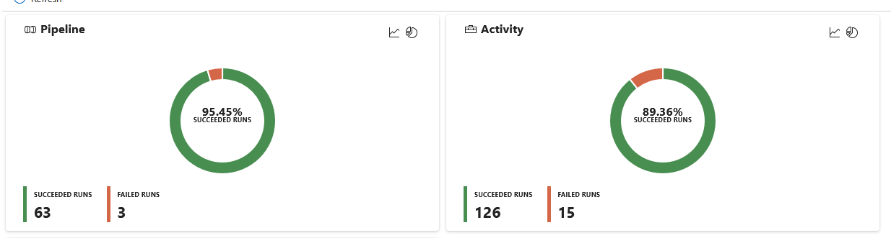
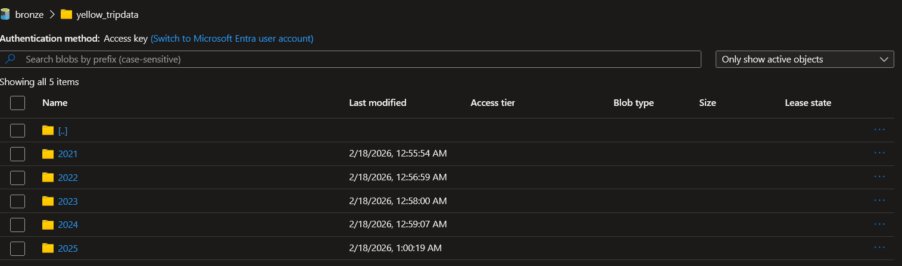


## Data Profiling — Bronze Layer

**Script:** `sql/01a_bronze_profiling.sql`

Before any cleaning, we profile the raw Bronze data to understand quality issues and justify every transformation decision. The script runs 13 analyses:

| # | Analysis | Key Finding |
|---|----------|-------------|
| 1 | Overview | Total record count, date range, file count |
| 2 | Records per year | Volume distribution across 2021–2025 |
| 3 | NULL analysis | `passenger_count`, `RatecodeID`, `store_and_fwd_flag` — **~24% NULL** |
| 4 | NULL rate per year | Identifies which years introduced the NULL problem |
| 5 | Vendor analysis | Vendor 7 has ~100% broken timestamps |
| 6 | Trip distance | Zero/negative distance outliers (~2.6%) |
| 7 | Trip duration | Reversed timestamps, <1 min, >24h trips |
| 8 | Location IDs | Values outside valid NYC TLC range (1–265) |
| 9 | Financial anomalies | Negative fares, corrections (~8.5%) |
| 10 | Payment type | Distribution across payment methods |
| 11 | Date range | Records outside expected 2021–2025 window |
| 12 | **DROP vs COALESCE** | **~24% lost with naive DROP vs ~4.5% with smart filtering** |
| 13 | Filter impact | Per-filter breakdown of removed records |

> **Key Insight (Analysis #12):** Dropping rows with NULLs would lose ~24% of all data. The COALESCE strategy in Silver preserves these records by filling NULLs with domain-appropriate defaults, reducing total loss to ~4.5%.

---

## Transformation — Bronze → Silver

**Script:** `sql/01_bronze_to_silver.sql`

Silver is the cleaned version of Bronze data. Strategy: **fix what you can, only remove impossible records.**

### Step 1: Bronze View (OPENROWSET)

The view `bronze.vw_yellow_taxi_raw` reads raw Parquet files directly from the Data Lake.

> **Note:** The `airport_fee` column has inconsistent casing across years (`airport_fee` in 2021, `Airport_fee` in 2025). Solution: read both versions and merge with `COALESCE`.

### Step 2: Fixing NULLs (COALESCE)

Instead of dropping rows with NULLs (~24% of data!), we fill them with sensible defaults:

| Column | Issue | Fix |
|--------|-------|-----|
| `passenger_count` | 24% NULL | → `1` (default 1 passenger) |
| `RatecodeID` | 24% NULL | → `1` (standard rate) |
| `store_and_fwd_flag` | 24% NULL | → `'N'` (not stored) |
| `congestion_surcharge` | 24% NULL | → `0.00` |
| `airport_fee` | 24-91% NULL | → `0.00` |
| `cbd_congestion_fee` | doesn't exist before 2024 | → `0.00` |

### Step 3: Filtering (WHERE)

We remove **only physically impossible records** (~4.5% of data):

| Filter | Removed | Reason |
|--------|---------|--------|
| `VendorID IN (1,2)` | 1.54% | Vendor 7 has 100% broken dates, Vendor 6 unofficial |
| `trip_distance > 0 AND < 500` | 2.62% | Zero distance = cancellation/GPS error |
| `pickup < dropoff` | 1.49% | 97% from Vendor 7 (reversed timestamps) |
| `duration 1-1440 min` | 2.56% | < 1 min = meter test, > 24h = forgotten |
| `LocationID 1-265` | 0.00% | Locations outside NYC |
| `Date 2021-2025` | 0.00% | Data outside ingestion range |

> **Total removed: ~4.5% | Retained: ~95.5%**

### Step 4: `trip_status` Flag

Negative amounts (refunds, complaints, disputes) **are not deleted** — they are flagged:

| `trip_status` | Description | Share |
|---------------|-------------|-------|
| `valid` | Normal trip | ~87% |
| `correction` | Refund/complaint (negative fare, negative total, or total > 1000) | ~8.5% |

This allows the Gold Layer to filter by `trip_status = 'valid'` for clean KPIs, while corrections remain available for separate analysis.

### Step 5: Column Standardization

- Names → `snake_case` (e.g. `VendorID` → `vendor_id`)
- Types → `DECIMAL(10,2)` for monetary amounts, `INT` for identifiers
- Derived columns: `trip_duration_minutes`, `trip_year`, `trip_month`, `trip_day`, `trip_weekday`, `pickup_hour`

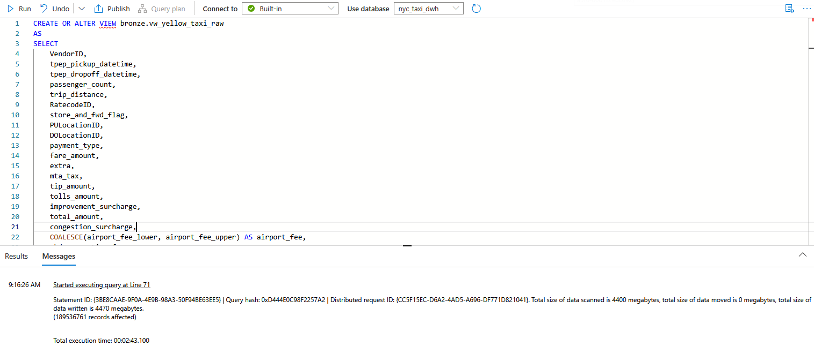
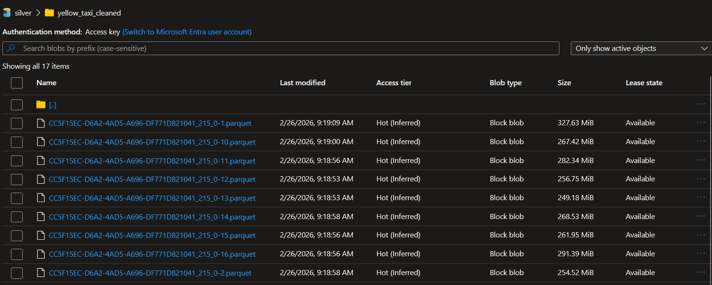


---

## Transformation — Silver → Gold

**Script:** `sql/02_silver_to_gold.sql`

Gold is the business layer ready for BI tools (e.g. Power BI).
It is built as a **Star Schema** which provides native performance, easy DAX measure creation, and a unified time dimension.

### Star Schema (Entity Relationship)

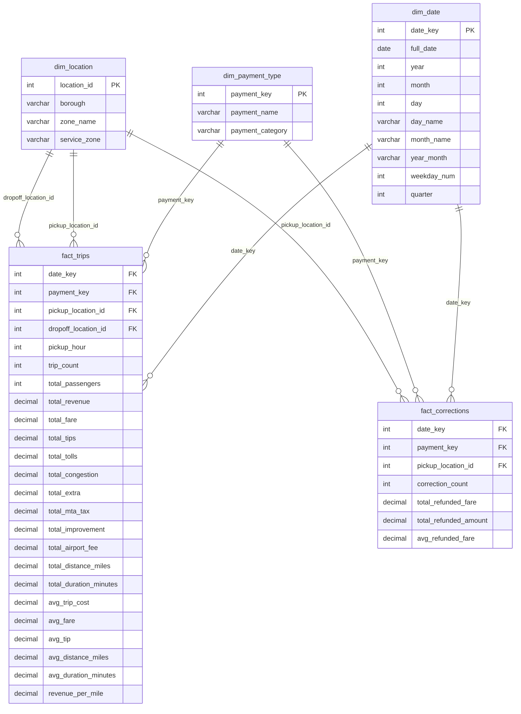
```mermaid
erDiagram
    dim_date ||--o{ fact_trips : date_key
    dim_payment_type ||--o{ fact_trips : payment_key
    dim_location ||--o{ fact_trips : pickup_location_id
    dim_location ||--o{ fact_trips : dropoff_location_id
    dim_date ||--o{ fact_corrections : date_key
    dim_payment_type ||--o{ fact_corrections : payment_key
    dim_location ||--o{ fact_corrections : pickup_location_id

    dim_date {
        int date_key PK
        date full_date
        int year
        int month
        int day
        varchar day_name
        varchar month_name
        varchar year_month
        int weekday_num
        int quarter
    }

    dim_payment_type {
        int payment_key PK
        varchar payment_name
        varchar payment_category
    }

    dim_location {
        int location_id PK
        varchar borough
        varchar zone_name
        varchar service_zone
    }

    fact_trips {
        int date_key FK
        int payment_key FK
        int pickup_location_id FK
        int dropoff_location_id FK
        int pickup_hour
        int trip_count
        int total_passengers
        decimal total_revenue
        decimal total_fare
        decimal total_tips
        decimal total_tolls
        decimal total_congestion
        decimal total_extra
        decimal total_mta_tax
        decimal total_improvement
        decimal total_airport_fee
        decimal total_distance_miles
        decimal total_duration_minutes
        decimal avg_trip_cost
        decimal avg_fare
        decimal avg_tip
        decimal avg_distance_miles
        decimal avg_duration_minutes
        decimal revenue_per_mile
    }

    fact_corrections {
        int date_key FK
        int payment_key FK
        int pickup_location_id FK
        int correction_count
        decimal total_refunded_fare
        decimal total_refunded_amount
        decimal avg_refunded_fare
    }
```

> **Important:** The `trip_status` flag is used when splitting into fact tables: `fact_trips` takes only valid trips, while `fact_corrections` separately aggregates refunds and complaints to avoid skewing the main financial KPIs.

### Tables (Dimensions & Facts)

#### `gold.dim_date`
Calendar dimension with attributes such as day names, month names, and composite keys (`year_month` for Power BI). Enables Time Intelligence in aggregations.

#### `gold.dim_payment_type`
Payment method lookup table with mapped categories (Credit Card, Cash, Others).

#### `gold.dim_location`
Taxi zone lookup dimension with all 265 official NYC TLC zones. Contains borough name, zone name, and service zone category (Yellow Zone, Boro Zone, Airports, EWR). Data sourced from [NYC TLC Taxi Zone Lookup](https://www.nyc.gov/site/tlc/about/tlc-trip-record-data.page).

#### `gold.fact_trips`
Central fact table with data aggregated at the *date + hour + payment + pu_location + do_location* level. Contains all metrics (fares, tips, distance, duration).

#### `gold.fact_corrections`
Separate table for analyzing cancellations and refunds, grouping negative trips.

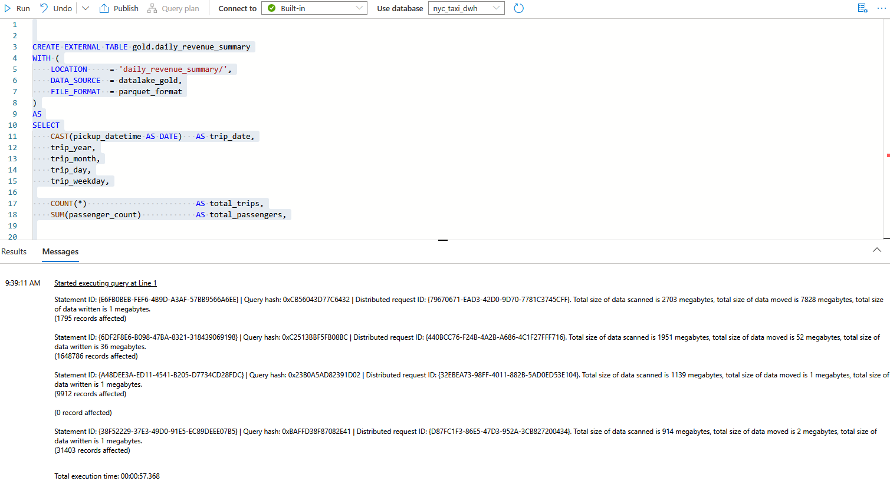
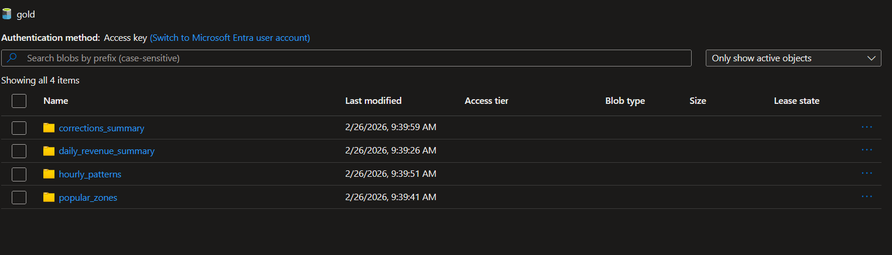
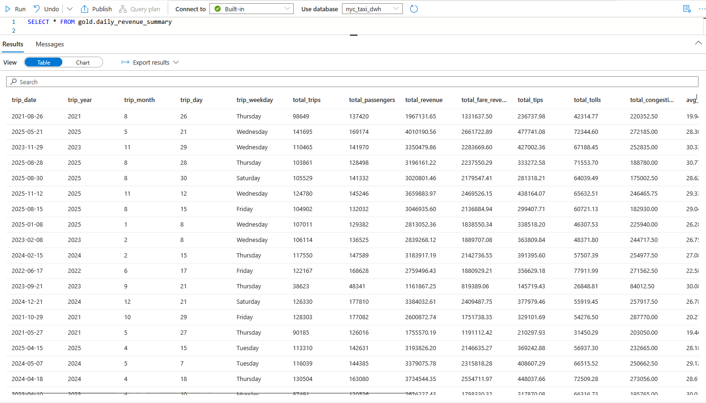

---

## Data Quality Tests

### Silver Tests (`sql/03_tests_silver.sql`) — 18 tests

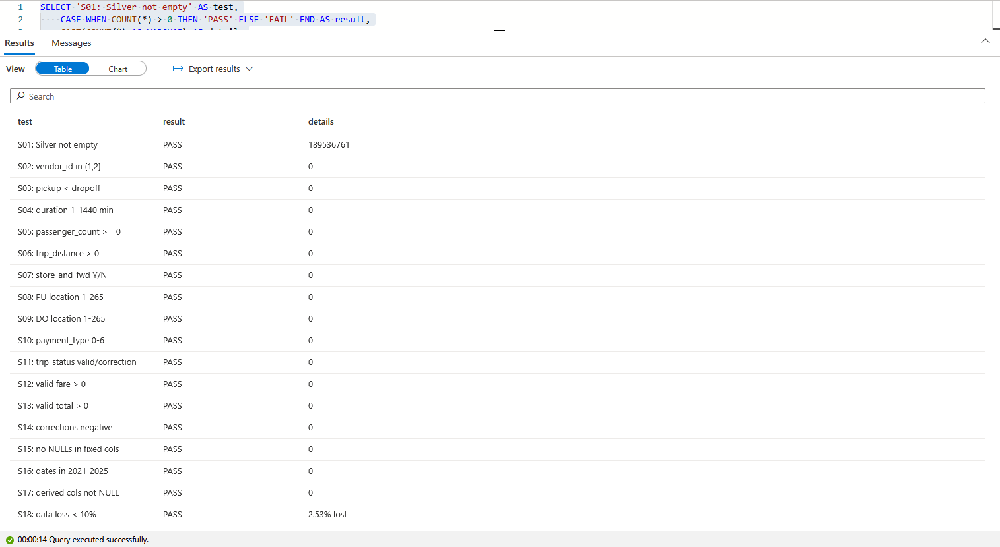

### Gold Tests (`sql/04_tests_gold.sql`) — 21 tests

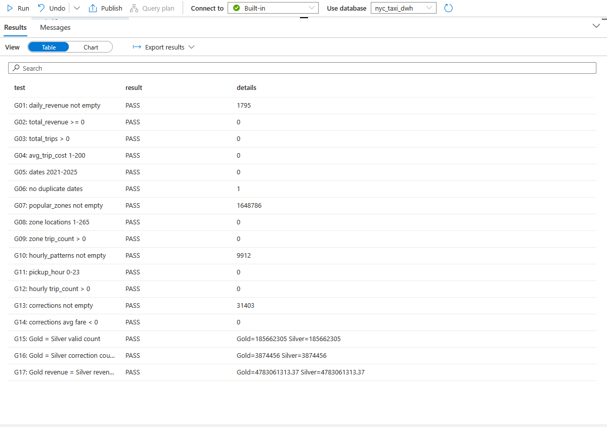

### ETL Audit (`sql/05_etl_audit.sql`)

A post-pipeline audit snapshot that captures pipeline health in a single `gold.etl_audit` table:

| Metric | Description |
|--------|-------------|
| Row counts | Bronze, Silver (valid/correction), Gold per table |
| Data loss % | `(1 - Silver/Bronze) × 100` — must be ≤ 10% |
| Revenue reconciliation | Gold revenue vs Silver valid revenue (diff < $1) |
| Row count reconciliation | `SUM(trip_count)` in Gold = `COUNT(*)` in Silver |
| Freshness | Days since latest record in Bronze |
| Pipeline status | `HEALTHY` if all checks pass, `NEEDS ATTENTION` otherwise |

---

## Getting Started

### Prerequisites

- Azure CLI (`az login`)
- Terraform >= 1.5
- Access to Synapse Studio or another SQL client that can run the provided scripts

### Step by Step

```bash
# 1. Infrastructure
cp terraform.tfvars.example terraform.tfvars
# Edit terraform.tfvars
terraform init
terraform plan
terraform apply
```

```bash
# 2. Ingestion — run the pipelines in ADF
# Azure Portal → Data Factory → pl_ingest_all_data → Trigger
# Azure Portal → Data Factory → pl_ingest_metadata  → Trigger
```

```sql
-- 3. Synapse — run SQL scripts to create views, tables, and Stored Procedures:
-- sql/00_setup.sql              ← database, credentials, data sources, file format

-- Current repo state: create schemas manually before running the remaining scripts
CREATE SCHEMA bronze;
CREATE SCHEMA silver;
CREATE SCHEMA gold;

-- Then run:
-- sql/01a_bronze_profiling.sql  ← creates bronze.sp_run_profiling
-- sql/01_bronze_to_silver.sql   ← creates view & silver.sp_load_yellow_taxi_incremental
-- sql/03_tests_silver.sql       ← creates silver.sp_run_tests
-- sql/02_silver_to_gold.sql     ← creates gold.sp_load_gold_layer
-- sql/04_tests_gold.sql         ← creates gold.sp_run_tests
-- sql/05_etl_audit.sql          ← creates gold.sp_run_etl_audit

-- 4. Execute the SQL steps manually in the current version of the repo:
EXEC bronze.sp_run_profiling;

-- This procedure is parameterized by year and month.
-- It is an incremental monthly load, but the repo does not currently include
-- a persisted Watermark table or an ADF pipeline that orchestrates Silver/Gold.
EXEC silver.sp_load_yellow_taxi_incremental '2021', '01';
EXEC silver.sp_run_tests;
EXEC gold.sp_load_gold_layer;
EXEC gold.sp_run_tests;
EXEC gold.sp_run_etl_audit;
```

> **Note:** In `sql/00_setup.sql`, replace `<storage_account_name>` with the value from `terraform output datalake_name` and `<your_master_key_password>` with your own password.

### Destroying Resources

> **⚠️ Warning:** This will delete **all** Azure resources and data (Bronze/Silver/Gold). This action cannot be undone.

```bash
terraform destroy
```

## Power BI Dashboards

The Power BI report connects to the Gold Layer via **DirectQuery** to Azure Synapse Serverless SQL Pool. The report consists of 4 pages, accessible through a navigation bar at the top.

> **Note:** The included `raport.pbix` file contains only 2 sample months of data loaded for demonstration purposes. After deploying your own infrastructure, connect the report to your Synapse endpoint to work with the full dataset (~200M records).

### Page 1: Executive Overview

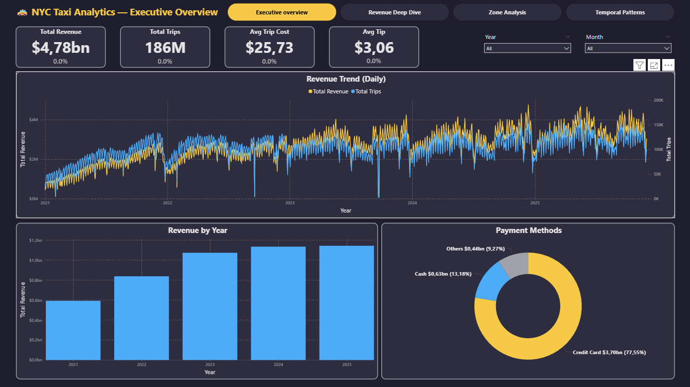


### Page 2: Revenue Deep Dive

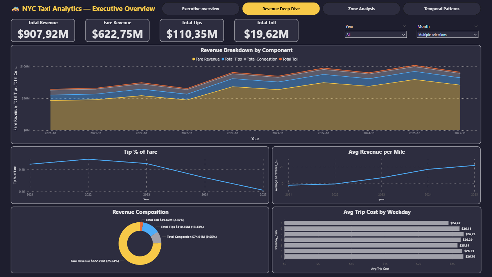


### Page 3: Zone Analysis

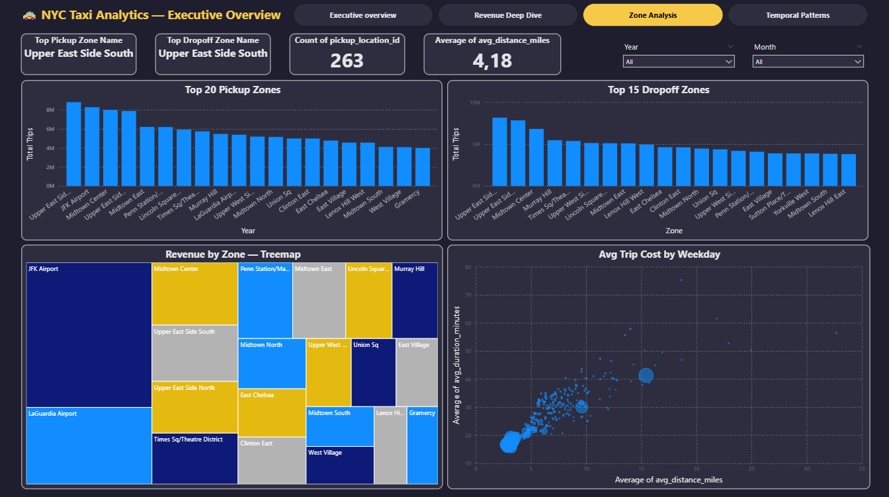


### Page 4: Temporal Patterns

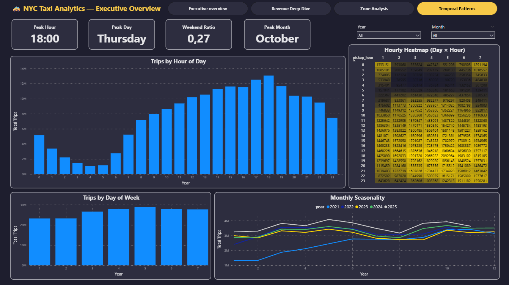


