# Azure NYC Taxi — Data Warehouse

Hurtownia danych dla NYC Yellow Taxi zbudowana na platformie Azure w architekturze Medallion (Bronze → Silver → Gold).

> **Źródło danych:** [NYC TLC Trip Record Data](https://www.nyc.gov/site/tlc/about/tlc-trip-record-data.page)
> **Zakres:** Yellow Taxi, styczeń 2021 – listopad 2025 (~200M rekordów)


---

## Spis treści

1. [Architektura](#architektura)
2. [Infrastruktura (Terraform)](#infrastruktura-terraform)
3. [Ingestion — Bronze Layer](#ingestion--bronze-layer)
4. [Transformacja — Bronze → Silver](#transformacja--bronze--silver)
5. [Transformacja — Silver → Gold](#transformacja--silver--gold)
6. [Testy jakości danych](#testy-jakości-danych)
7. [Uruchomienie projektu](#uruchomienie-projektu)
8. [Dashboardy Power BI](#dashboardy-power-bi)


---

## Architektura

```mermaid
flowchart LR
    A["🌐 NYC TLC API\n(Parquet files)"] -->|Azure Data Factory| B["🥉 BRONZE\n(raw data)"]
    B -->|Synapse SQL| C["🥈 SILVER\n(cleaned)"]
    C -->|Synapse SQL| D["🥇 GOLD\n(aggregated)"]
    D -->|DirectQuery| E["📊 Power BI\n(dashboards)"]

    style A fill:#1a1a2e,stroke:#4cc9f0,stroke-width:2px,color:#fff
    style B fill:#1a1a2e,stroke:#cd7f32,stroke-width:2px,color:#fff
    style C fill:#1a1a2e,stroke:#c0c0c0,stroke-width:2px,color:#fff
    style D fill:#1a1a2e,stroke:#ffd700,stroke-width:2px,color:#fff
    style E fill:#1a1a2e,stroke:#f72585,stroke-width:2px,color:#fff
```



> **Storage:** Wszystkie warstwy (Bronze/Silver/Gold) → Azure Data Lake Storage Gen2

| Warstwa | Opis | Format | Lokalizacja |
|---------|------|--------|-------------|
| **Bronze** | Surowe dane bez zmian | Parquet (Snappy) | `bronze/yellow_tripdata/` |
| **Silver** | Wyczyszczone, ustandaryzowane | Parquet (Snappy) | `silver/yellow_taxi_cleaned/` |
| **Gold** | Zagregowane KPI i metryki | Parquet + Views | `gold/*/` |

### Użyte technologie

| Komponent | Technologia |
|-----------|-------------|
| IaC | Terraform |
| Ingestion | Azure Data Factory |
| Storage | Azure Data Lake Storage Gen2 |
| Processing | Azure Synapse Analytics (Serverless SQL) |
| Wizualizacja | Power BI (DirectQuery) |
| Autoryzacja | Managed Identity|


---

## Infrastruktura (Terraform)

Cała infrastruktura zdefiniowana jako kod (IaC) w plikach `.tf`:

| Plik | Opis |
|------|------|
| `main.tf` | Provider, Resource Group |
| `storage.tf` | Storage Account, ADLS Gen2 filesystems (bronze, silver, gold) |
| `data_factory.tf` | Azure Data Factory |
| `pipeline.tf` | ADF Linked Services, Datasets, Pipelines (ingestion) |
| `synapse.tf` | Synapse Workspace (Serverless SQL Pool) |
| `security.tf` | Role assignments, Managed Identity |
| `variables.tf` | Zmienne (prefix, location) |
| `outputs.tf` | Outputy (nazwy zasobów, URLs) |

### Deployment

```bash
terraform init
terraform plan
terraform apply
```


