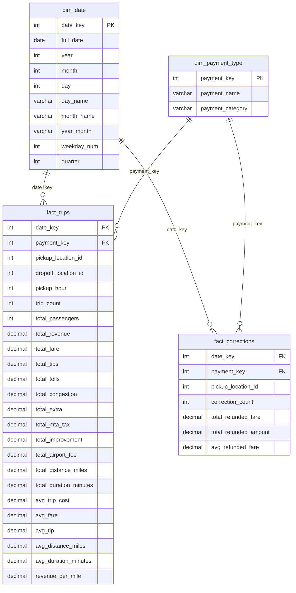

[](README.md)
[](README_PL.md)

# Azure NYC Taxi — Data Lakehouse

Hurtownia danych dla NYC Yellow Taxi zbudowana na platformie Azure w architekturze Medallion (Bronze → Silver → Gold).

> **Źródło danych:** [NYC TLC Trip Record Data](https://www.nyc.gov/site/tlc/about/tlc-trip-record-data.page)
> **Zakres:** Yellow Taxi, styczeń 2021 – listopad 2025 (~200M rekordów)

---

## Spis treści

1. [Architektura](#architektura)
2. [Infrastruktura (Terraform)](#infrastruktura-terraform)
3. [Ingestion — Bronze Layer](#ingestion--bronze-layer)
4. [Transformacja — Bronze → Silver](#transformacja--bronze--silver)
5. [Transformacja — Silver → Gold](#transformacja--silver--gold)
6. [Testy jakości danych](#testy-jakości-danych)
7. [Uruchomienie projektu](#uruchomienie-projektu)
8. [Dashboardy Power BI](#dashboardy-power-bi)


---

## Architektura


> **Storage:** Wszystkie warstwy (Bronze/Silver/Gold) → Azure Data Lake Storage Gen2

| Warstwa | Opis | Format | Lokalizacja |
|---------|------|--------|-------------|
| **Bronze** | Surowe dane bez zmian | Parquet (Snappy) | `bronze/yellow_tripdata/` |
| **Silver** | Wyczyszczone, ustandaryzowane | Parquet (Snappy) | `silver/yellow_taxi_cleaned/` |
| **Gold** | Schemat Gwiazdy (KPI) | Parquet | `gold/*/` |

### Użyte technologie

| Komponent | Technologia |
|-----------|-------------|
| IaC | Terraform |
| Ingestion | Azure Data Factory |
| Storage | Azure Data Lake Storage Gen2 |
| Processing | Azure Synapse Analytics |
| Wizualizacja | Power BI (DirectQuery) |
| Autoryzacja | Managed Identity|


---

## Infrastruktura (Terraform)

Cała infrastruktura zdefiniowana jako kod (IaC) w plikach `.tf`:

| Plik | Opis |
|------|------|
| `main.tf` | Provider, Resource Group |
| `storage.tf` | Storage Account, ADLS Gen2 filesystems (bronze, silver, gold) |
| `data_factory.tf` | Azure Data Factory |
| `pipeline.tf` | ADF Linked Services, Datasets, Pipelines (ingestion) |
| `synapse.tf` | Synapse Workspace (Serverless SQL Pool) |
| `security.tf` | Role assignments, Managed Identity |
| `variables.tf` | Zmienne|
| `outputs.tf` | Outputy (nazwy zasobów, URLs) |

---

## Ingestion — Bronze Layer

Azure Data Factory pobiera pliki Parquet z NYC TLC API i zapisuje je w ADLS Gen2 (Bronze).

### Pipeline

```
pl_ingest_year (ForEach month 01-12)
  └── pl_ingest_single_month (Copy Activity)
        Source: https://d37ci6vzurychx.cloudfront.net/trip-data/yellow_tripdata_{year}-{month}.parquet
        Sink:   bronze/yellow_tripdata/{year}/yellow_tripdata_{year}-{month}.parquet
```

| Parametr | Wartość |
|----------|---------|
| Równoległość | 4 miesiące jednocześnie |
| Retry | 2 próby, 30s przerwa |
| Timeout | 1h na plik |
| Kompresja | Snappy |

> **Błędy w pipeline wynikają z tego, że za grudzień 2025 nie ma jeszcze dostępnych plików, a pipeline próbował je pobrać.**


## Transformacja — Bronze → Silver

**Skrypt:** `sql/01_bronze_to_silver.sql`

Silver to wyczyszczona wersja danych Bronze. Strategia: **napraw co się da, usuń tylko błedne rekordy.**

### Krok 1: Widok Bronze (OPENROWSET)

Widok `bronze.vw_yellow_taxi_raw` czyta surowe pliki Parquet bezpośrednio z Data Lake.

> **Uwaga:** Kolumna `airport_fee` ma różną wielkość liter między latami (`airport_fee` w 2021, `Airport_fee` w 2025). Rozwiązanie: czytamy obie wersje i łączymy `COALESCE`.

### Krok 2: Naprawianie NULLi (COALESCE)

Zamiast usuwać wiersze z NULLami (~24% danych!), naprawiamy je sensownymi wartościami domyślnymi:

| Kolumna | Problem | Rozwiązanie |
|---------|---------|-------------|
| `passenger_count` | 24% NULL | → `1` (domyślnie 1 pasażer) |
| `RatecodeID` | 24% NULL | → `1` (taryfa standardowa) |
| `store_and_fwd_flag` | 24% NULL | → `'N'` (nie przechowywano) |
| `congestion_surcharge` | 24% NULL | → `0.00` |
| `airport_fee` | 24-91% NULL | → `0.00` |
| `cbd_congestion_fee` | nie istnieje do 2024 | → `0.00` |

### Krok 3: Filtrowanie (WHERE)

Usuwamy **tylko fizycznie niemożliwe rekordy** (~4.5% danych):

| Filtr | Usunięte | Dlaczego |
|-------|----------|----------|
| `VendorID IN (1,2)` | 1.54% | Vendor 7 ma 100% zepsutych dat, Vendor 6 nieoficjalny |
| `trip_distance > 0 AND < 500` | 2.62% | Zerowy dystans = anulacja/błąd GPS |
| `pickup < dropoff` | 1.49% | 97% to Vendor 7 (odwrócone daty) |
| `duration 1-1440 min` | 2.56% | < 1 min = test taksometru, > 24h = zapomniany |
| `LocationID 1-265` | 0.00% | Lokalizacje poza NYC |
| `Date 2021-2025` | 0.00% | Dane spoza zakresu ingestion |

> **Łącznie usunięto: ~4.5% | Zachowano: ~95.5%**

### Krok 4: Flaga `trip_status`

Ujemne kwoty (zwroty, reklamacje, spory) **nie są usuwane** — są oznaczone flagą:

| `trip_status` | Opis | Udział |
|---------------|------|--------|
| `valid` | Normalny kurs | ~87% |
| `correction` | Zwrot/reklamacja (ujemny fare, ujemny total lub total > 1000) | ~8.5% |

Dzięki temu Gold Layer może filtrować po `trip_status = 'valid'` dla czystych KPI, a korekty są dalej dostępne do osobnej analizy.

### Krok 5: Standaryzacja kolumn

- Nazwy → `snake_case` (np. `VendorID` → `vendor_id`)
- Typy → `DECIMAL(10,2)` dla kwot, `INT` dla identyfikatorów
- Kolumny pochodne: `trip_duration_minutes`, `trip_year`, `trip_month`, `trip_day`, `trip_weekday`, `pickup_hour`


---

## Transformacja — Silver → Gold

**Skrypt:** `sql/02_silver_to_gold.sql`

Gold to warstwa biznesowa gotowa do podłączenia pod systemy klasy BI (np. Power BI).
Została zbudowana w **Schemacie Gwiazdy (Star Schema)** co daje natywną wydajność, łatwość budowania miar (DAX) i ujednolicony wymiar czasu.

### Schemat Gwiazdy (Entity Relationship)



> **Ważne:** Zastosowano flagę `trip_status` w trakcie rozdzielania na fakty: `fact_trips` bierze wyłącznie poprawne kursy, a `fact_corrections` oddzielnie agreguje zwroty i reklamacje by nie zaburzać głównych KPI finansowych.

### Tabele (Dimensions & Facts)

#### `gold.dim_date`
Wymiar kalendarzowy z atrybutami, np. nazwy dni, miesięcy i złączone klucze (`year_month` dla Power BI). Pozwala na używanie Time Intelligence w agregacjach.

#### `gold.dim_payment_type`
Słownik sposobów płatności ze zmapowanymi kategoriami (Credit Card, Cash, Others).

#### `gold.fact_trips`
Centralna tabela faktów z danymi agregowanymi na poziomie *date + hour + payment + pu_location + do_location*. Posiada wszystkie metryki (opłaty, napiwki, dystans, czas trwania).

#### `gold.fact_corrections`
Wydzielona tabela do analizy anulacji i zwrotów, grupująca negatywne przejazdy.


---

## Testy jakości danych

### Silver Tests (`sql/03_tests_silver.sql`) — 18 testów


### Gold Tests (`sql/04_tests_gold.sql`) — 16 testów


---

## Uruchomienie projektu

### Wymagania

- Azure CLI (`az login`)
- Terraform >= 1.5
- Python 3.x + pandas (do lokalnych testów)

### Krok po kroku

```bash
# 1. Infrastruktura
cp terraform.tfvars.example terraform.tfvars
# Edytuj terraform.tfvars
terraform init
terraform plan
terraform apply
```

```bash
# 2. Ingestion — uruchom pipeline w ADF
# Azure Portal → Data Factory → pl_ingest_all → Trigger
```

```sql
-- 3. Synapse — uruchom skrypty SQL w kolejności:
-- sql/00_setup.sql        ← baza danych, credentials, data sources
-- sql/01_bronze_to_silver.sql  ← transformacja Bronze → Silver
-- sql/03_tests_silver.sql      ← walidacja Silver
-- sql/02_silver_to_gold.sql    ← transformacja Silver → Gold
-- sql/04_tests_gold.sql        ← walidacja Gold
```

> **Uwaga:** W `sql/00_setup.sql` zamień `<storage_account_name>` na wartość z `terraform output datalake_name` oraz `<your_master_key_password>` na własne hasło.

### Usunięcie zasobów

> **⚠️ Uwaga:** To usunie **wszystkie** zasoby Azure i dane (Bronze/Silver/Gold). Nie da się tego cofnąć.

```bash
terraform destroy
```

## Dashboardy Power BI

Raport Power BI łączy się z warstwą Gold przez **DirectQuery** do Azure Synapse Serverless SQL Pool. Raport składa się z 4 stron, dostępnych przez pasek nawigacji u góry.

> **Uwaga:** Załączony plik `raport.pbix` zawiera jedynie 2 przykładowe miesiące danych wgrane w celach demonstracyjnych. Po wdrożeniu własnej infrastruktury podłącz raport do swojego endpointu Synapse, aby pracować z pełnym zbiorem danych (~200M rekordów).

### Strona 1: Executive Overview


### Strona 2: Revenue Deep Dive


### Strona 3: Zone Analysis


### Strona 4: Temporal Patterns


